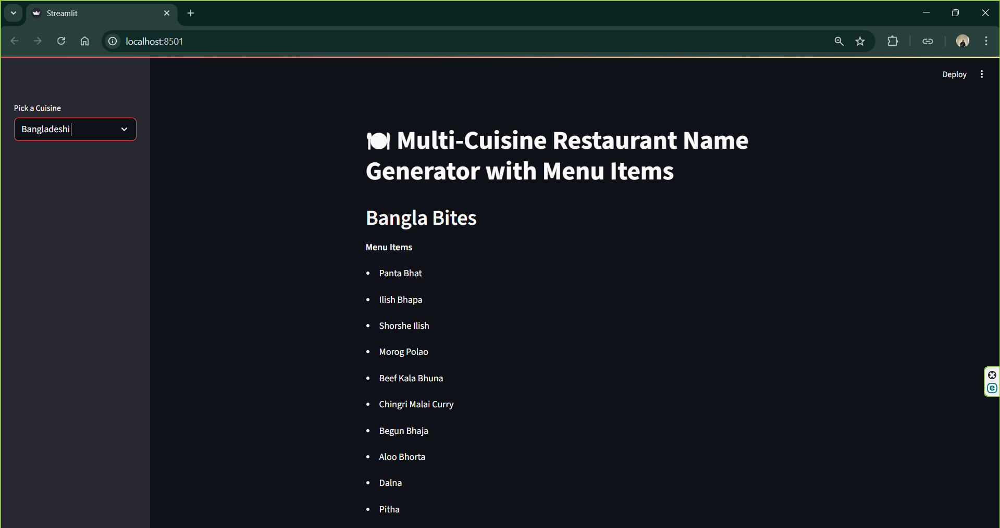

# Multi-Cuisine-Restaurant-Name-Generator-with-Menu


The Streamlit app is a Restaurant Name Generator of different cuisines worldwide. You select the cuisine name like 'Italian', 'Chinese' etc and it will generate a fancy name.   
Also, it will provide few menu items list which you can include for your new restaurant.

It basically uses LangChain, GROQ API calls and a simple Streamlit interface.

The [app.py](assets/app.py) file contains the whole code which contains:
### LLM Setup
This connects our model to the llm by the secret api key of groq. Collect the secret api key and keep it in any file in the same directory like: secret_key.py and keep it in a variable named key or anything.    Then import that key in the app.py file. 
I set the temperature=0.6 
```
temperature=0 -> safe response; temperature=1 -> creative and risky response
```

I have used the model = openai/gpt-oss-120b, you can use any other models by checking the documentation of GROQ.

### Response Fetching function
The function get_names_items contains two chains, One for cuisine and another for menu items.
It will return the response as key value pair.

### Show Response on Streamlit 
It includes a sidebar, when the cuisine is selected from the selectbox it sends the cuisine name to the function and retrieves the name and menu item list.


## Workflow
```
Streamlit -> Sidebar -> Selectbox -> Pass Cuisine Variable to Function -> Calls First Chain -> Groq -> Second Chain -> Groq -> Return  Response -> Show on Streamlit
```

### Run App
Go to terminal and type:
```
streamlit run app.py
```
It automatically opens your default browser and you can run it smoothly.

The project was very fun to build and hope everyone will also be able to build similar LangChain projects.

